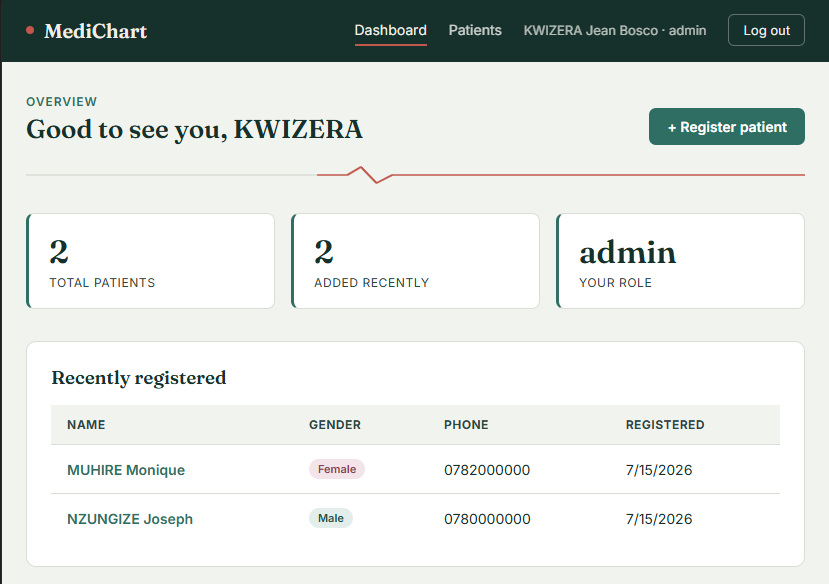
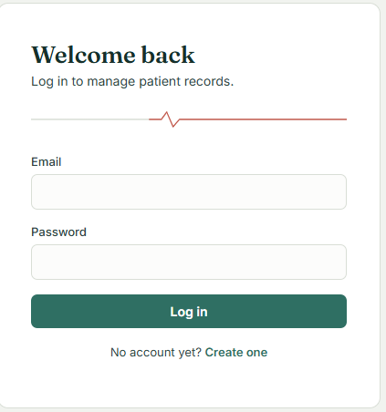
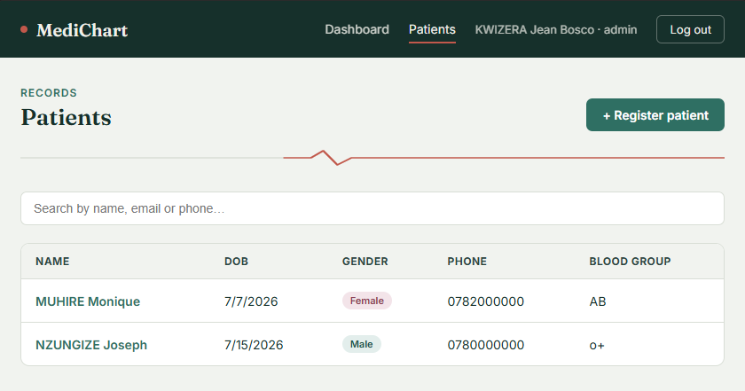
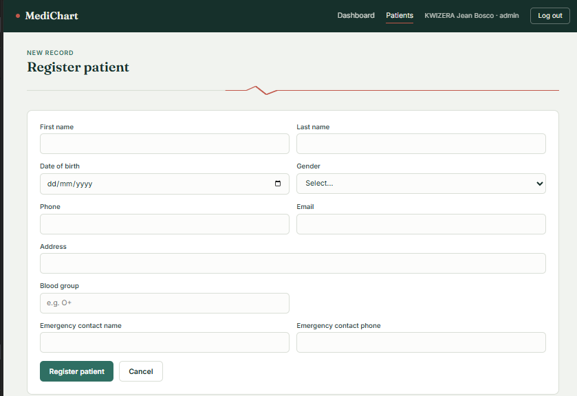

# Patient Management System

A full-stack healthcare management application for managing patient records and
improving healthcare information management through a centralized system.


## Screenshots





## Features
- User authentication (register / login, JWT-based, staff & admin roles)
- Patient registration
- Patient profile management
- Patient medical records (visit history: diagnosis, treatment, notes)
- Full CRUD on patients and records
- Search and pagination
- MySQL database integration

## Technologies used
**Frontend:** Vue 3, Vue Router, Axios, Vite, HTML/CSS
**Backend:** Node.js, Express.js
**Database:** MySQL
**Tools:** Git & GitHub, Postman, VS Code

## System architecture
The Vue frontend communicates with the Express backend through a REST API
(`/api/auth/*`, `/api/patients/*`). The backend authenticates requests with
JWT and reads/writes data in a MySQL database.

```
patient-management-system/
├── backend/          Express API (Node.js + MySQL)
│   ├── config/       DB connection
│   ├── controllers/  Route logic
│   ├── middleware/   JWT auth
│   ├── routes/       API routes
│   ├── sql/          schema.sql (run this first)
│   └── server.js
└── frontend/         Vue 3 app (Vite)
    └── src/
        ├── api/       Axios client
        ├── components/
        ├── router/
        ├── store/     Simple reactive auth store
        └── views/     Login, Register, Dashboard, Patients
```

## Installation and setup

### Prerequisites
- Node.js 18+ and npm
- MySQL Server 8+ running locally (or accessible remotely)

### 1. Set up the database
Open a MySQL client (Workbench, CLI, or similar) and run the schema file:

```bash
mysql -u root -p < backend/sql/schema.sql
```

This creates the `patient_management` database with `users`, `patients`,
and `patient_records` tables.

### 2. Backend setup

```bash
cd backend
npm install
cp .env.example .env
```

Edit `.env` and set your MySQL credentials (`DB_USER`, `DB_PASSWORD`) and a
long random `JWT_SECRET`. Then start the API:

```bash
npm run dev
```

The API runs on `http://localhost:5000` by default. Check it's alive at
`http://localhost:5000/api/health`.

### 3. Frontend setup

Open a second terminal:

```bash
cd frontend
npm install
cp .env.example .env
npm run dev
```

The app runs on `http://localhost:5173`. Open it in your browser.

### 4. First use
1. Go to `http://localhost:5173/register` and create a staff account.
2. Log in.
3. Register your first patient from the Dashboard or Patients page.

## API overview

| Method | Endpoint                              | Description                  |
|--------|----------------------------------------|-------------------------------|
| POST   | /api/auth/register                    | Create a user account        |
| POST   | /api/auth/login                       | Log in, returns a JWT        |
| GET    | /api/auth/me                          | Current logged-in user       |
| GET    | /api/patients                         | List patients (search, page) |
| POST   | /api/patients                         | Register a patient           |
| GET    | /api/patients/:id                     | Patient details + records    |
| PUT    | /api/patients/:id                     | Update a patient              |
| DELETE | /api/patients/:id                     | Delete a patient              |
| POST   | /api/patients/:id/records              | Add a medical record          |
| DELETE | /api/patients/:id/records/:recordId    | Delete a medical record        |

All `/api/patients/*` routes require an `Authorization: Bearer <token>` header.

## Notes
- Passwords are hashed with bcrypt before being stored. 

